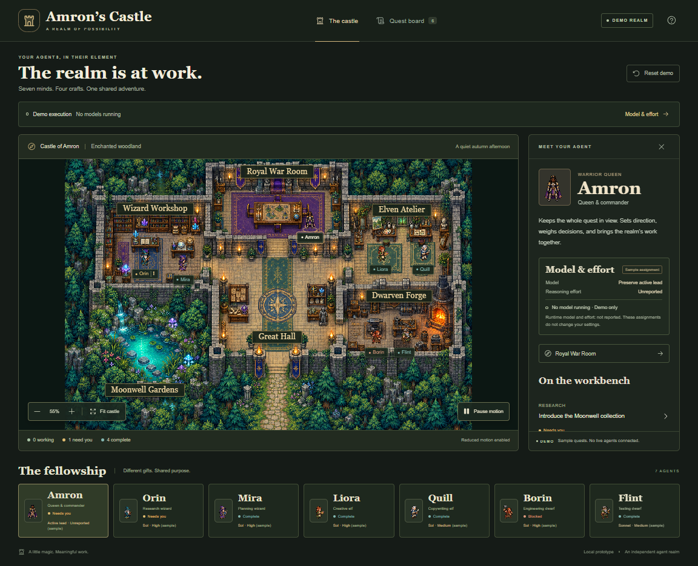

# Amron’s Castle

An independent, interactive fantasy RPG interface for agent work. Explore a castle, inspect a persistent cast of specialists, and follow tasks through explicit review and handoff.

Queen **Amron** is inspired by the creator’s wife. “Amron” is her name spelled backwards. Her identity belongs to the character, not to a model or model release. She remains a Black warrior queen with dark braids, a crown, gold-trimmed armor and a violet cloak.



## Run locally

Use Node.js 24 or later:

```sh
npm ci
npm run dev
```

Open the address printed by Vite. The default experience is **Demo**, with fictional tasks and no model calls, accounts or backend dependencies. Progress is kept in memory and resets on reload.

```sh
npm run typecheck
npm test
npm run build
npm run preview
```

The static build is in `dist/client`. Relative asset URLs support hosting under a repository subpath. Keep dependency notices with redistributed builds.

## Explore

- Select a room or agent; drag to pan and scroll or use buttons to zoom.
- Inspect Orin’s Moonwell brief. Approve to hand work to the next specialist, or request changes to keep the current owner and feedback.
- Every stage waits for approval, through Amron’s final review.
- Inspect sample model/effort assignments without confusing them with runtime telemetry.
- Use keyboard controls, Pause motion, reduced-motion preferences and Reset demo.

The Queen coordinates from the Royal War Room. Orin and Mira research and plan in the Wizard Workshop; Liora and Quill design and write in the Elven Atelier; Borin and Flint engineer and test in the Dwarven Forge. Identities persist as tasks change owners.

## Independent core, optional integrations

This repository owns the UI, artwork, simulation, typed data and tests. It does not depend on a Genesis checkout. The existing [Genesis adapter](adapters/genesis/README.md) is optional and opens only with `?mode=live`, when hosted by a compatible authenticated dashboard. It reads observations and links to that dashboard’s review controls; it does not dispatch or approve real work.

The default demo makes no API requests. No credentials, private records, machine-specific configuration or private dashboard addresses are included. Other backends can supply their own adapter while reusing the scene and character model.

## Structure

- `src/model.ts`: persistent identities, rooms, typed demo state, transitions and walkable routes.
- `src/Scene.tsx` and `src/assets.ts`: Canvas rendering, camera, sprite frames and accessible overlays.
- `src/App.tsx`: standalone demo experience.
- `src/live.ts`, `src/useLiveCastle.ts`, `src/LiveApp.tsx`: optional Genesis observation adapter.
- `public/assets`: original generated raster artwork and dependency notices.
- `tests`: transition, selection, model-display and observation-contract checks.

[Case study](case-study.md) · [Artwork provenance](ASSET_PROVENANCE.md) · [Dependency notices](THIRD_PARTY_NOTICES.md) · [Contributing](CONTRIBUTING.md)

## License

Released under the [MIT License](LICENSE), including the project code and original generated artwork. Third-party components retain their existing licenses in `licenses/`.
