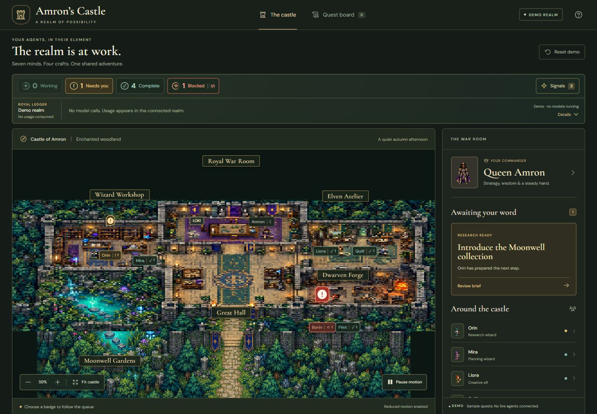

# Amron’s Castle

An independent, interactive fantasy RPG interface for agent work. Explore a castle, inspect a persistent cast of specialists, and follow tasks through explicit review and handoff.

**v0.1.0 · Public prototype · MIT**

[Release notes](CHANGELOG.md) · [Enhancement ledger](docs/ENHANCEMENTS.md) · [Backlog and ideas](BACKLOG.md) · [Report a bug](https://github.com/jacobmedley/Amrons-Castle/issues/new?template=bug_report.yml)

Queen **Amron** is inspired by the creator’s wife. “Amron” is her name spelled backwards. Her identity belongs to the character, not to a model or model release. She remains a Black warrior queen with dark braids, a crown, gold-trimmed armor and a violet cloak.



## Run locally

Use Node.js 24 or later:

```sh
npm ci
npm run dev
```

Open the address printed by Vite. The default experience is **Demo**, with fictional tasks and no model calls, accounts or backend dependencies. Progress is kept in memory and resets on reload.

```sh
npm run typecheck
npm test
npm run build
npm run preview
```

The static build is in `dist/client`. Relative asset URLs support hosting under a repository subpath. Keep dependency notices with redistributed builds.

## Explore

- Select a room or agent; drag to pan and scroll or use buttons to zoom.
- Select **Full screen** in the castle toolbar to fill the display with the scene. Use **Exit full screen** to return to the command view, then switch to the quest or work board.
- Inspect Orin’s Moonwell brief. Approve to hand work to the next specialist, or request changes to keep the current owner and feedback.
- Every stage waits for approval, through Amron’s final review.
- Inspect sample model/effort assignments without confusing them with runtime telemetry.
- Use keyboard controls, Pause motion, reduced-motion preferences and Reset demo.
- Click Working, Needs you, Complete or Blocked to visit the next task in that queue. Repeated clicks cycle through individual tasks and center the responsible character.
- Use the command sidebar to switch between the castle and work board, inspect queues and signals, and expand usage details. On a phone, these controls sit above the castle.
- Open Signals to inspect new handoffs and status changes. Reading a signal never approves work.
- Watch the fellowship rest, stretch, enjoy tea and play chess between quests. These idle scenes are decorative.
- In the connected realm, expand the Royal Ledger to choose a usage source and reporting window. Cache reuse, account allowance and proven savings remain separate quantities.
- Open the ledger without moving the castle: the panel expands over the scene, then its contents fade in. Escape or an outside click closes it.
- Find LOKI in the Royal War Room. Select him to invite a fairy when motion is enabled. Ambient stories, fish and torchlight do not represent model work.

The Queen coordinates from the Royal War Room. Orin and Mira research and plan in the Wizard Workshop; Liora and Quill design and write in the Elven Atelier; Borin and Flint engineer and test in the Dwarven Forge. Identities persist as tasks change owners.

## Understand updates and customization

The live adapter checks recorded work about every 6 seconds and usage about every 30 seconds while the page is visible. The check counter advances even when tasks stay unchanged. Upstream usage can be cached. Ordinary Codex chats, including development of this project, are not automatically Genesis runs.

Pause motion stops visual effects; live observations continue. In the Demo, pausing also stops simulated progression. Operating-system reduced motion provides a static scene and disables fairy invitations.

Character-name editing, selectable color themes and saved preferences are **planned**, not available in this release. The [backlog](BACKLOG.md) defines their acceptance criteria. Bug and enhancement reports use GitHub forms; the application does not upload diagnostics automatically.

## Independent core, optional integrations

This repository owns the UI, artwork, simulation, typed data and tests. It does not depend on a Genesis checkout. The existing [Genesis adapter](adapters/genesis/README.md) is optional and opens only with `?mode=live`, when hosted by a compatible authenticated dashboard. It reads observations and links to that dashboard’s review controls; it does not dispatch or approve real work.

The default demo makes no API requests. No credentials, private records, machine-specific configuration or private dashboard addresses are included. Other backends can supply their own adapter while reusing the scene and character model.

## Structure

- `src/model.ts`: persistent identities, rooms, typed demo state, transitions and walkable routes.
- `src/Scene.tsx` and `src/assets.ts`: Canvas rendering, camera, sprite frames and accessible overlays.
- `src/ambience.ts`: lighting, pond animation and LOKI's decorative fairy encounters.
- `src/App.tsx`: standalone demo experience.
- `src/live.ts`, `src/useLiveCastle.ts`, `src/LiveApp.tsx`: optional Genesis observation adapter.
- `src/signals.ts`, `src/KingdomSignals.tsx`: shared queue ordering, agent badges and notification ledger.
- `src/telemetry.ts`, `src/UsageReadout.tsx`: source-specific usage validation and compact readout.
- `public/assets`: castle/character artwork, companion assets, generation prompts and dependency notices.
- `tests`: transition, selection, model-display and observation-contract checks.

[Case study](case-study.md) · [Artwork provenance](ASSET_PROVENANCE.md) · [Dependency notices](THIRD_PARTY_NOTICES.md) · [Contributing](CONTRIBUTING.md) · [Release procedure](docs/RELEASING.md)

The [command view verification](docs/changes/command-view/verification.md), [kingdom signals verification](docs/changes/kingdom-signals/verification.md) and [living castle verification](docs/changes/living-castle/verification.md) record interaction, layout, animation and telemetry evidence. The current suite has 35 tests. Browser checks do not establish full accessibility conformance or physical-device coverage.

## Troubleshoot the prototype

| Symptom | What to check |
|---|---|
| Characters do not animate | Check Pause motion and your operating-system reduced-motion setting. In live mode, stale or partial observations also pause the scene. |
| Live task counts stay unchanged | Check the successful-check counter. Existing completed work stays complete; this view does not track every open coding conversation. |
| Usage does not change at each check | Check its source, reporting window, retrieval time and coverage notes. Upstream records can be cached. |
| Live mode says unavailable | Use the standalone Demo unless a compatible authenticated host is installed. The repository does not include the Genesis server. |
| Preferences or tasks reset | Demo state is in memory. Persistent customization is planned in the backlog. |
| Artwork or fonts do not load | Run the app through Vite or a web server, not a `file:` URL. For a static host, keep the full `dist/client` directory and its relative asset paths. |

For another problem, [file a bug](https://github.com/jacobmedley/Amrons-Castle/issues/new?template=bug_report.yml) with your version, environment and reproduction steps. Read [SECURITY.md](SECURITY.md) before reporting a vulnerability. Follow the [code of conduct](CODE_OF_CONDUCT.md) in project discussions.

## License

Released under the [MIT License](LICENSE), including the project code and original generated artwork. Third-party components retain their existing licenses in `licenses/`.
