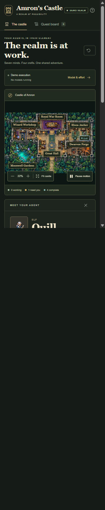

# Amron’s Castle: making agent work visible

A fantasy RPG interface for following work across a persistent cast of specialists. Queen Amron is inspired by the creator’s wife, with her name spelled backwards. Her identity is independent of any model release.

## Frame the problem

An agent workflow can be difficult to read as a series of messages and status updates. A task may move between specialties while the person supervising it needs a more immediate answer: who owns it, what is ready to inspect, and where is a decision needed?

Amron’s Castle explores a spatial answer. Rooms represent stable kinds of work. Characters retain their identities. A quest changes hands without turning one specialist into another.

This began as a design brief and an interactive prototype, not a finding from a user study. The aim was to make ownership and review points inspectable while giving the experience a distinctive, inviting setting.

## Build around a persistent cast

| Character | Role | Home |
|---|---|---|
| Amron | Strategy, coordination and final judgment | Royal War Room |
| Orin | Research | Wizard Workshop |
| Mira | Planning | Wizard Workshop |
| Liora | Creative design | Elven Atelier |
| Quill | Copywriting | Elven Atelier |
| Borin | Engineering | Dwarven Forge |
| Flint | Testing | Dwarven Forge |

Amron is a Black warrior queen with dark braids, a crown, gold-trimmed armor and a deep violet cloak. Each specialist has a distinct silhouette, palette and workstation. Those visual identities remain constant throughout the task journey.

The Great Hall connects the work areas and anchors the quest board. Dense emerald woodland, warm torchlight and a luminous turquoise pool make the surrounding grounds feel part of the same world.

## Keep the world readable

The visual direction draws on overhead 16-bit RPG interiors: roofless rooms, textured stone, visible work surfaces and compact character sprites. The environment and character sheets were generated as original raster artwork. Supplied game screenshots informed the perspective and palette; no game sprites were extracted or bundled.

The map is the dominant element. A restrained dark-stone interface, warm text and readable type let the artwork carry the atmosphere. Room labels, names, statuses and actions are HTML text, separate from the pixels. The experience does not depend on recognizing a tiny sprite or reading text painted into the background.

Generated artwork also introduced a concrete implementation constraint: the resulting room geometry and sprite spacing did not precisely match the requested coordinates. Workstation anchors, source-frame rectangles, foot baselines and walkable routes were measured against the finished images. The forge uses a short route within its room rather than walking through a wall implied by an earlier composition request.

## Make review an explicit action

The sample Moonwell quest begins with a research brief. Approval passes it through design, engineering, copy and testing before Amron’s final review. Every stage stops for a decision. Requesting changes retains the current owner, stage and feedback.

Walking and working animations help make changes visible, but the task record is authoritative. A character’s location is not evidence that a task is complete. The side panel shows the owner, current work, recent activity and sample output; the quest board gives a second, non-spatial way to inspect the same state.

## Separate demonstration from observation

The public experience is deliberately labeled **Demo**. It uses fictional tasks and deterministic transitions, with no model calls or live agents. The model-and-effort display distinguishes illustrative assignments from runtime-accepted settings. The latter remain unreported. Amron’s lead configuration is not guessed from her name or role.

A private companion connects to Genesis checkpoint observations. Its activation and checks are handled separately from the public demo. That creates a different evidence boundary: an observed record can describe what was reported at a particular point, but cannot by itself prove that a model is still running or that requested settings were accepted. The independent repository defaults to the demo and includes an optional host adapter. Its screenshots contain no private work records.

## Support more than pointer interaction

Canvas provides the scene, while HTML provides accessible controls. Room and agent controls are available through the keyboard. Selecting a character or quest moves focus into its details; dismissing the panel returns focus to a visible trigger. Controls clipped outside the map are removed from the tab order.

On narrow screens, the detail panel sits below the map and compact markers reduce label collisions. The named roster remains available. Manual pause stops motion and demo progression; device reduced-motion freezes sprite animation and travel while tasks remain inspectable.

## Verify the interaction, then state its limits

Implementation verification covered the full six-approval journey, requesting changes, resuming a blocked sample task, task filters and reset. Focused automated tests covered review pauses, stable identities, ownership transitions, revisions, coordinate selection, surveyed walking routes and the model-and-effort display. Strict type checking and a production build passed for the verified demo.

Desktop and phone-width browser checks examined selection, zoom, pan, panel behavior, keyboard focus and reduced motion. Independent source review identified clipped controls in keyboard navigation and focus loss after actions; both were repaired and rechecked.

This evidence shows that the demonstrated interaction works within the tested prototype. It does not establish improved productivity, user preference, real-world agent performance, or accessibility conformance. The project has not been evaluated through user studies or physical-device testing. Demo state resets on reload.

## Account for the work

The project owner supplied the concept, character direction, reference imagery and visual approval. The lead AI assistant composed the environment, built the application, integrated the assets and verified the browser journey. Two bounded artwork workers produced Amron’s animation sheet and the six specialist sheets with frame measurements. A test worker added model-and-effort regression coverage, and an independent review worker checked the implementation and accessibility fixes.

Requested worker model and effort settings were inherited from the lead session. Independently accepted settings were not exposed and remain unverified. No token, time, financial or environmental savings are claimed.

The result is an explorable interface that makes one design idea concrete: stable places and identities can give a workflow structure, while explicit records and review actions keep its meaning clear.

[Return to the project](README.md) · [Artwork provenance](ASSET_PROVENANCE.md) · [Screenshot captions and alt text](screenshot-captions.md)
