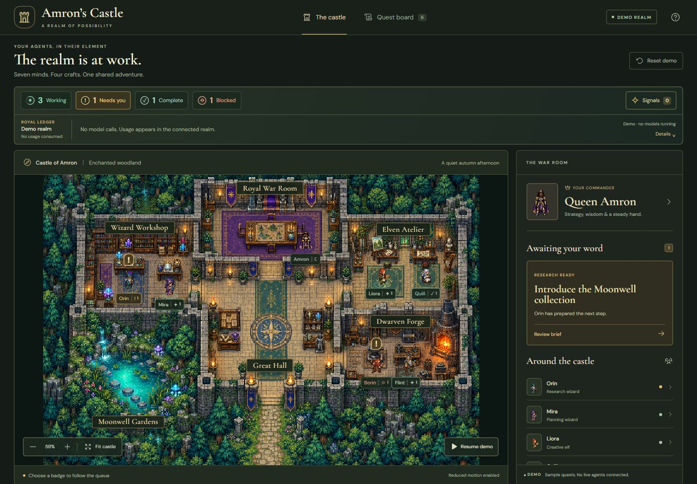
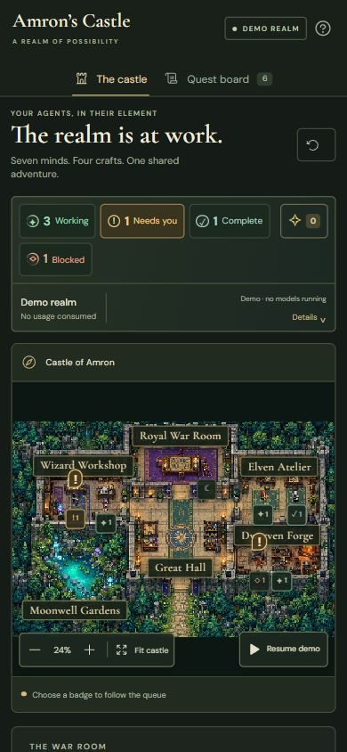

# Kingdom signals verification

Verified October 7, 2026 on `feat/kingdom-signals`.

The castle now uses a fluid layout, actionable status queues, a local notification ledger, original idle poses, attention signals, and a compact usage readout. The standalone Demo stays fictional and makes no model calls. The optional Genesis adapter reads the host's existing authenticated observation endpoints.

## Visual evidence

These captures contain only fictional Demo data. Private account values and live run records are excluded.

| Check | Result |
|---|---|
| Layout at 390, 767, 1440 and 2560 CSS pixels | No horizontal page overflow. Details stack below the castle on narrow screens; the castle expands beside the panel on desktop. |
| Phone map labels | Compact status/count markers at distant zoom avoid overlapping character names. Selecting a character restores their name; accessible names and the roster retain the full identity. |
| Typography | Tighter paragraphs, ruled data rows, separated columns and tabular numbers inspected. Original stone, woodland, water and queen artwork preserved. |
| Original idle artwork | Fourteen poses, two per character, inspected at actual rendering scale with measured foot anchors. Tea, sleep, stretching and chess remain decorative. |
| Idle atlas transparency | Original 1536 × 1024 RGBA output preserved unchanged; transparent background verified. Nonuniform frame rows and per-pose anchors measured instead of assuming a grid. |
| Motion | Canvas pixels change with motion enabled and remain identical while paused. Reduced-motion preference also produced identical scene pixels between samples. Attention uses a short in-place hop and static alternatives. |

The [idle frame check](screenshots/idle-frame-check.png) renders every pose at its measured ground anchor. Artwork was produced with the built-in image-generation tool using the existing character sheets as references. See the [full prompt](../../../public/assets/idle.prompt.txt), [original atlas](../../../public/assets/idle.png) and [asset provenance](../../../ASSET_PROVENANCE.md).

## Interaction evidence

- Wheel zoom changed the camera from fit scale to 107%; dragging moved the projected agent position by the pointer delta. **Fit castle** restored the complete composition.
- Room selection centered the Royal War Room. Character selection opened Amron's persistent profile.
- **Needs you** selected Orin's specific Moonwell brief and centered him. Requesting changes retained his identity, research stage and feedback. After reset, approval transferred that same quest to Liora at the design stage and updated the badges and notification.
- Repeated live **Complete** clicks advanced through both recorded completions. Their details opened without assigning a fictitious current agent; the Great Hall is their destination.
- Notification inspection, mark-all-read and Escape dismissal worked. The first live snapshot created no historical notification flood. Escape restored focus to the trigger; if approval disabled that trigger, focus returned to the brand link.
- Demo reset restored the sample tasks and cleared queue cursors and notifications.
- A simulated connection failure retained labeled last-known counts and changed all agent activity to unconfirmed. Refresh after restoring the connection returned to Connected. No real review or task mutation was performed.
- The current production bundle was installed into the existing local host's static Castle directory and checked in its connected view. No service restart, backend change or public site deployment was needed.

## Automated checks

`npm run typecheck`, `npm test` and `npm run build` pass. The suite contains **33 passing tests** covering:

- The complete six-approval Demo journey, approval pauses, revision feedback, scoped blocker resolution and reset.
- Coordinate selection under zoom/pan, route continuity, surveyed walkable floor and furniture avoidance.
- Queue ordering and wrapping, removed entries, invalid timestamps, multiple tasks per agent and ownerless live completions.
- Initial notification baselines, meaningful-change deduplication, read state, bounded history and reset behavior.
- Independent telemetry sources and windows, invalid/missing counters, stale/partial/unavailable data and exclusion of unrelated private fields.

The browser walkthrough exercised revision and the first approval handoff; the full six-stage journey is covered by model tests. Background visibility cancellation is implemented and reviewed, but native tab-background transitions were not separately automated. No Python backend tests were rerun because this change only updates the frontend and static installation.

## Telemetry scope and limits

The compact hierarchy is inspired by [Token Use](https://tokenuse.app/), using the castle's own palette and components. The connected readout exposes fresh input, cache reuse, reported output, calls, provenance and available daily call buckets.

- Token Use reports the current calendar month. Genesis cloud and desktop CLI receipts expose their own selected window. These overlapping sources are selectable and are never added together.
- Account allowance and reset time are **Not connected**: the installed host feed does not expose them. A development-only Codex account snapshot is not a browser data source.
- **Tokens saved: Not measured** remains explicit. Cache-read tokens are measured reuse, not a supported savings baseline or a subscription bill. No billed cost is inferred.
- Missing metrics stay unavailable rather than becoming zero. Stale and partial coverage remain visible. Known upstream accounting caveats are retained in the expanded source details.
- Requested model settings and independently accepted runtime settings stay distinct. The explanation is now a footnote with detailed inspection available.

The source remains an independent MIT project. This feature is committed locally on its own branch; private telemetry and live screenshots are not included in the public package.
