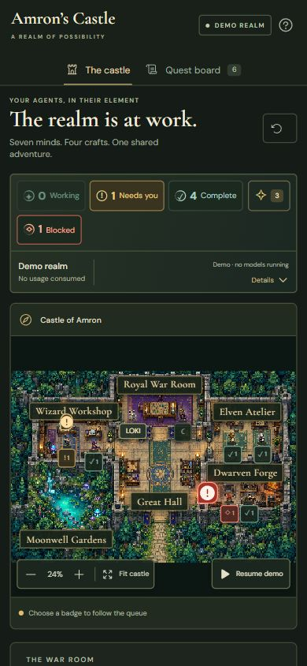
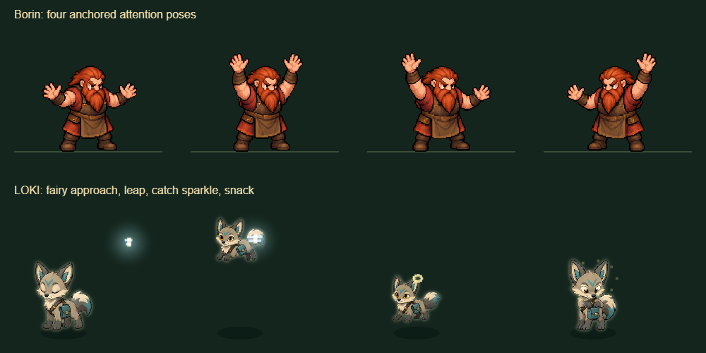
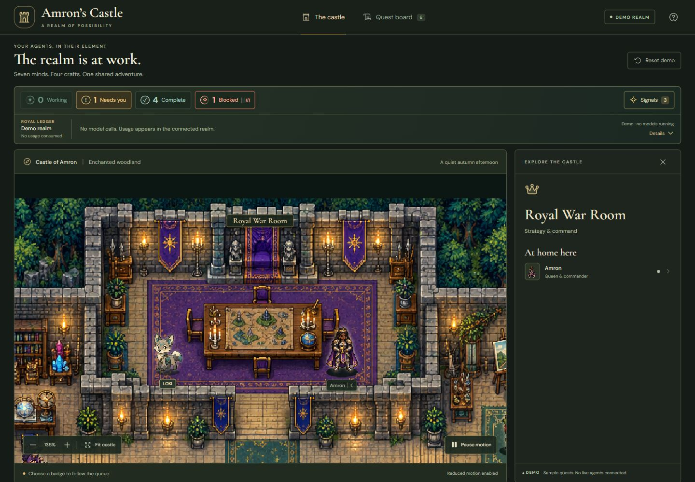

# Living castle: interaction and visual verification

October 7, 2026 · local feature branch `feat/living-castle`.

## Changes

- The ledger uses a real Phosphor caret icon and a keyboard-accessible disclosure button. Its panel floats over the scene instead of pushing it down. The panel expands over 220 ms using an ease-out curve; contents fade in after 100 ms. Closing, Escape, outside clicks and reduced motion are supported. Closed content is inert and hidden from accessibility navigation.
- Camera intent survives resize. A focused or manually panned/zoomed view retains its center; a fitted view continues to fit. The previous unconditional resize reset could undo badge navigation.
- Borin waves both arms using four original transparent poses. A larger red exclamation signal and red ground halo identify a blocked task. Characters have a subtle silhouette light and grounded shadow for separation from the background.
- LOKI uses the owner's existing custom pet artwork, unchanged, in the war room beside Amron. The companion is independent of task ownership and agent counts. Select LOKI to invite a fairy; otherwise a short visit occurs occasionally. LOKI leaps, catches the fairy in a sparkle and enjoys the snack. No sound or model call accompanies the event.
- Torches flicker gently, light falls through the atelier window, and the pond has ripples and three swimming fish. All effects use the scene's paused clock and honor reduced motion.

## Layout and browser evidence

At the desktop checkpoint, per-frame samples during ledger expansion showed the castle's top fixed at **360.80 CSS pixels** and its height fixed at **600 CSS pixels**. Panel height rose from zero while content opacity stayed zero for roughly the first 100 ms, then reached one. The camera and document layout remained stable.

The disclosure was checked with Escape and focus restoration. Resizing and badge navigation retained the selected 150% camera. Desktop and 390-pixel phone layouts were visually inspected. The panel scrolls internally when its contents exceed the available viewport.

All screenshots contain fictional Demo state. Private account telemetry and live run descriptions are excluded.

## Automatic updates

Browser network inspection observed successful automatic responses from `/api/castle` approximately six seconds apart and `/api/observe` approximately 30 seconds apart, without clicking Refresh. The live check counter advanced from 1 to 11 while the existing completed tasks stayed unchanged. A successful check and a changed task are separate facts.

The live page now shows its check number, time and whether task records changed. The ledger explains its 30-second checks, last successful check and possible source caching. Polling pauses while the document is hidden and resumes when visible. Pausing scene motion leaves live observation polling enabled.

This interface displays recorded Genesis run checkpoints. Ordinary Codex conversations, including development of this feature, do not automatically become Genesis runs. This work did not start a live pipeline job or mutate real review state.

## Validation

TypeScript and the production build pass. All **35 tests** pass, including existing queue, review, ownership, source-freshness, coordinate and route tests, plus bounded fish paths and occasional/invited fairy timing.

Original sprite alpha and frame occupancy were inspected. Borin's unequal generated cells use measured anchors. LOKI's empty atlas cells are excluded; the idle, leap and snack sequence was rendered from the actual runtime functions for the frame check above. Manual pause and reduced motion retain static artwork and disable fairy invitation while motion is unavailable.

The build was installed into the existing local Genesis static Castle directory. No backend code or service restart was needed. The standalone Demo remains independent of Genesis. These checks preceded the first numbered release; see the [release ledger](../../../CHANGELOG.md) for publication history. No public website deployment was performed.

Artwork paths and the complete built-in generation prompt are documented in [asset provenance](../../../ASSET_PROVENANCE.md).
